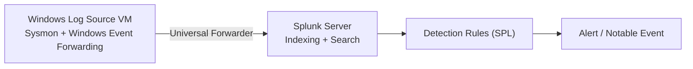

# SIEM Detection Engineering Lab

A Splunk-based detection lab: ingests Windows Event Logs and Sysmon telemetry, then implements, tests, and tunes custom detection rules for common attacker behaviors — brute force, lateral movement, and suspicious PowerShell execution.

## Architecture



## Stack

- **Splunk Enterprise** — Developer license (free, 10GB/day ingestion)
- **Splunk Add-on for Windows** + **Splunk Add-on for Sysmon** — required for parsed fields; without them logs arrive as raw XML
- **Sysmon** (Microsoft Sysinternals) — installed on the log-source VM with the config in [`sysmon-config.xml`](sysmon-config.xml)

## Setup

See [`docs/setup.md`](docs/setup.md) for the full install/config walkthrough (forwarder install, XML rendering setting, index creation).

## Detections implemented

| Detection | File | MITRE ATT&CK | What it catches |
|---|---|---|---|
| Repeated failed logons | [`detections/brute-force-auth.spl`](detections/brute-force-auth.spl) | T1110 Brute Force | 5+ failed logons (Event ID 4625) from one source within 5 minutes |
| Lateral movement via PsExec/SMB | [`detections/lateral-movement-psexec.spl`](detections/lateral-movement-psexec.spl) | T1021.002 SMB/Windows Admin Shares | Service creation events (7045) consistent with PsExec, plus admin share access |
| Encoded/obfuscated PowerShell | [`detections/powershell-encoded-command.spl`](detections/powershell-encoded-command.spl) | T1059.001 PowerShell | `-EncodedCommand` or `-enc` flags in process creation (4688) or Sysmon Event ID 1 |

Each `.spl` file includes the search, a comment explaining expected benign matches (false-positive sources), and the recommended analyst triage step.

## Tuning notes

Documented in [`docs/tuning-log.md`](docs/tuning-log.md) — tuning hypotheses for each rule, with space to record the false-positive counts you actually observe.

## Resume bullet (use once you have completed and verified the lab)

> Built a Splunk SIEM lab ingesting Windows Event Logs and Sysmon telemetry; authored 3 custom detection rules for brute-force, lateral movement, and encoded PowerShell execution, with documented false-positive tuning.

## Repo contents

```
├── README.md
├── docs/
│   ├── setup.md
│   └── tuning-log.md
├── detections/
│   ├── brute-force-auth.spl
│   ├── lateral-movement-psexec.spl
│   └── powershell-encoded-command.spl
└── sysmon-config.xml
```
