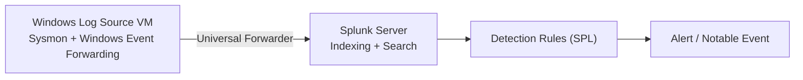
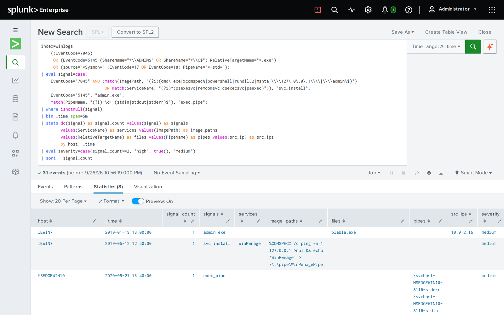
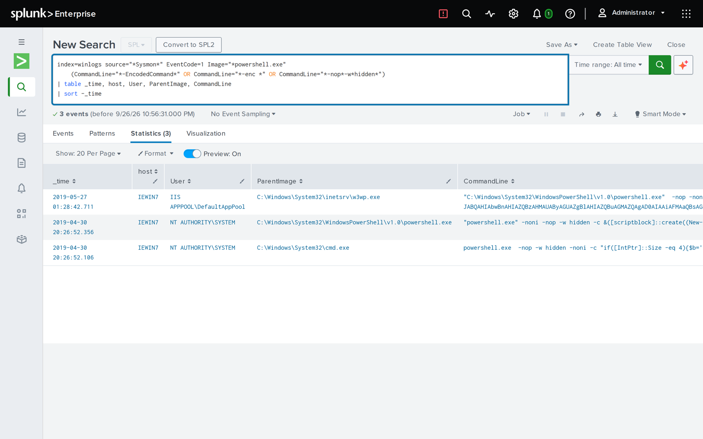

# SIEM Detection Engineering Lab

[](https://github.com/EbubeNnaemeka/siem-detection-lab/actions/workflows/detections.yml)

**Status:** Detections tested in Splunk against 37,364 real Windows attack events (public dataset). Live Windows log source pending the AD lab.

A Splunk-based detection lab: ingests Windows Event Logs and Sysmon telemetry, then implements, tests, and tunes custom detection rules for common attacker behaviors — brute force, lateral movement, and suspicious PowerShell execution.

## Architecture



## Stack

- **Splunk Enterprise** — Developer license (free, 10GB/day ingestion)
- **Splunk Add-on for Windows** + **Splunk Add-on for Sysmon** — required for parsed fields; without them logs arrive as raw XML
- **Sysmon** (Microsoft Sysinternals) — installed on the log-source VM with the config in [`sysmon-config.xml`](sysmon-config.xml)

## Setup

See [`docs/setup.md`](docs/setup.md) for the full install/config walkthrough (forwarder install, XML rendering setting, index creation).

## Detections implemented

| Detection | File | MITRE ATT&CK | What it catches |
|---|---|---|---|
| Repeated failed logons | [`detections/brute-force-auth.spl`](detections/brute-force-auth.spl) | T1110 Brute Force | 5+ failed logons (Event ID 4625) from one source within 5 minutes |
| Lateral movement via PsExec/SMB | [`detections/lateral-movement-psexec.spl`](detections/lateral-movement-psexec.spl) | T1021.002 SMB/Windows Admin Shares | Service creation events (7045) consistent with PsExec, plus admin share access |
| Encoded/obfuscated PowerShell | [`detections/powershell-encoded-command.spl`](detections/powershell-encoded-command.spl) | T1059.001 PowerShell | `-EncodedCommand` or `-enc` flags in process creation (4688) or Sysmon Event ID 1 |

Each `.spl` file includes the search, a comment explaining expected benign matches (false-positive sources), and the recommended analyst triage step.

## Testing against real attack logs

```bash
cp .env.example .env              # set a password and a HEC token (uuidgen)
docker compose up -d              # Splunk 10.4.3, localhost only
pip install python-evtx
python3 scripts/convert_evtx.py <EVTX-ATTACK-SAMPLES folder> events.json
python3 scripts/configure_splunk.py    # index, HEC, telemetry opt-out
python3 scripts/load_sample_data.py events.json
python3 scripts/run_detections.py
```

Results from the 2026-09-26 run ([full write-up](docs/tuning-log.md)):

| Rule | Result |
|---|---|
| Encoded PowerShell | 3 alerts, all malicious, including PowerShell spawned by the IIS worker `w3wp.exe` (web-shell pattern) |
| Lateral movement v1 | **Missed every sample**: it relied on the `PSEXESVC` service name, and attackers rename it |
| Lateral movement v2 | 8 alerts on 4 hosts, using tool-independent behaviour (named-pipe pattern, `.exe` dropped in `ADMIN$`, shell-command services) |
| Kerberoasting | Found a bug: v1 missed zero-padded `0x00000017`; fixed by comparing the numeric value |
| Brute force | No positive case in the dataset; still to test |

## Screenshots


*Behaviour-based lateral movement rule: renamed PsExec caught by its `.exe` drop and its `-stdin/-stdout/-stderr` pipes.*


*Encoded PowerShell rule: top hit is PowerShell spawned by the IIS worker `w3wp.exe`.*

## Resume bullet (use once you have completed and verified the lab)

> Built a Splunk detection lab and tested custom SPL rules against 37K real Windows attack events; rewrote a PsExec detection that missed renamed tools into a behaviour-based rule (0 → 8 detections) and fixed an encryption-type parsing bug in a Kerberoasting rule.

## Repo contents

```
├── README.md
├── docker-compose.yml
├── .env.example
├── docs/
│   ├── setup.md
│   └── tuning-log.md
├── screenshots/
├── scripts/
│   ├── configure_splunk.py
│   ├── convert_evtx.py
│   ├── load_sample_data.py
│   └── run_detections.py
├── detections/
│   ├── brute-force-auth.spl
│   ├── lateral-movement-psexec.spl
│   └── powershell-encoded-command.spl
└── sysmon-config.xml
```

---

Part of my homelab portfolio: **[ebube-nnaemeka.pages.dev](https://ebube-nnaemeka.pages.dev)** · [All projects](https://github.com/EbubeNnaemeka)
